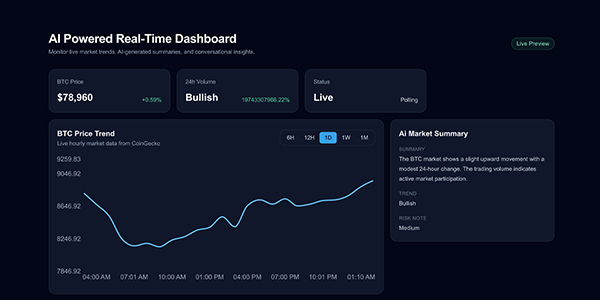

# AI-Powered Real-Time Market Dashboard

A real-time analytics dashboard built with Next.js, TypeScript, and OpenAI.  
It displays live BTC market data, generates AI-powered insights, and allows users to ask natural-language questions about dashboard data.



## Features

- Live BTC market data
- Auto-refreshing market statistics
- Interactive price chart
- Time range filtering
- AI-generated market insights
- “Ask the Data” conversational AI interface
- Loading skeletons and error handling
- Responsive dashboard UI

## Tech Stack

- Next.js
- TypeScript
- Tailwind CSS
- Recharts
- OpenAI API
- CoinGecko API
- Vercel

## AI Features

The app uses OpenAI through secure Next.js API routes.  
The API key is never exposed on the client side.

AI is used for:

- Market summary generation
- Trend explanation
- Risk notes
- Conversational Q&A over live dashboard data

## Getting Started

Clone the repository:

```bash
git clone https://github.com/harkalopchan/AI-Real-Time-Dashboard.git
cd your-project-name
npm install